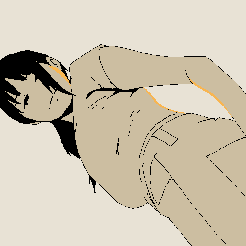

<html>
<body><link rel="preconnect" href="https://fonts.googleapis.com">
  <link rel="preconnect" href="https://fonts.gstatic.com" crossorigin>
  <link href="https://fonts.googleapis.com/css2?family=Rubik+Mono+One&display=swap" rel="stylesheet">

<h1 class="heading">Hey People</h1>

I am a high school senior with a passion 😉 for

Design, CS and Creative Industry who

loves to explore new things.

Mostly looking out for clouds ☁.

 
  
Currently, I am working on my portfolio 🥳 and

  
it has been a great (+ chaotic) journey till now.

 

 

This is Fernanda Diaz's Artwork on Youtube.

<style>
body {
  background-color: #8ECAE6;
}
.heading {
font-family: 'Rubik Mono One', monospace;  }
p{
  line-height: 50%;
}
</body>
</html>
